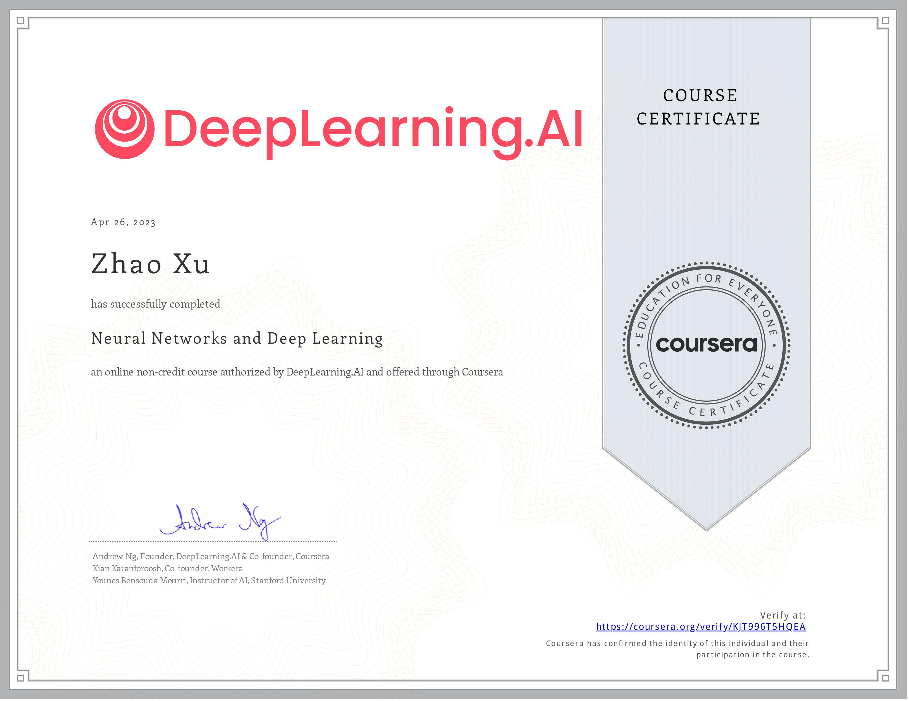
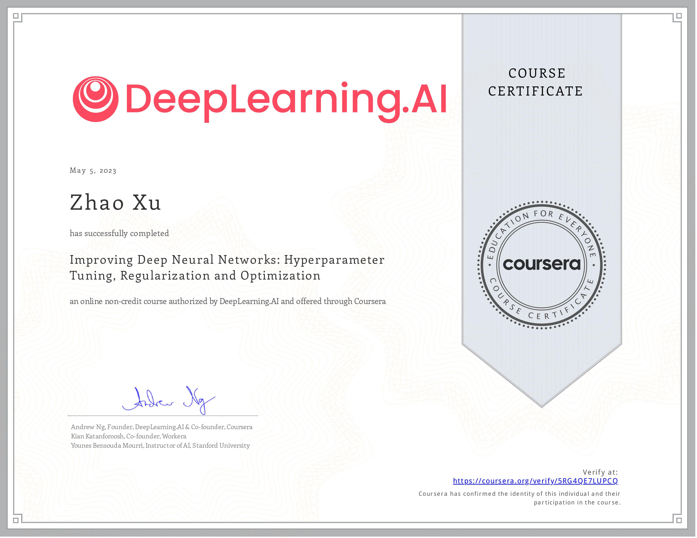
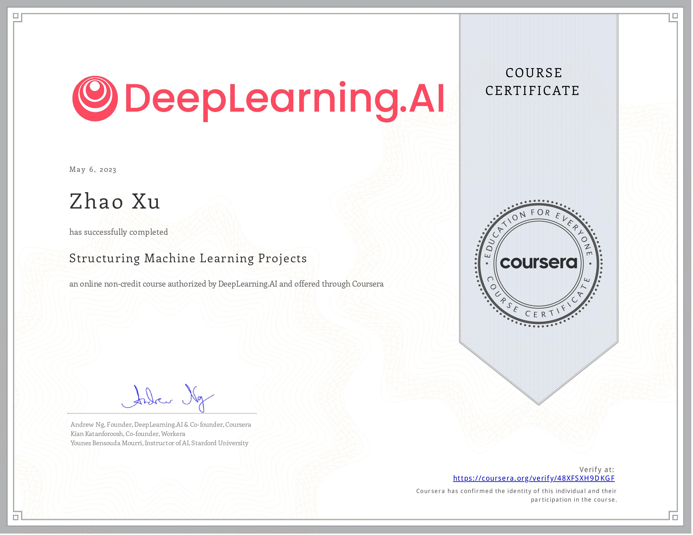

# Coursera Courses

[Zhao XU][l1]

## Introduction

This repo contains part of my work for [Coursera][l2] Courses. *(USNews: Coursera is an online learning platform offering self-paced guided projects and on-demand courses on a variety of subjects. The platform partners with universities and companies, including Amazon Web Services, Google and IBM, to provide courses. Users can earn digital certificates to share on their resumes or with their LinkedIn networks.)*

## Programming Assignments

### Deep Learning Specialization

[Notes](https://github.com/zhaoxu98/CourseNotes/blob/main/Coursera/Notes/DNN)

- Course 1: Neural Networks and Deep Learning

  - [Week 2 - PA 1 - Logistic Regression with a Neural Network mindset](https://github.com/zhaoxu98/CourseNotes/blob/main/Coursera/Deep%20Learning%20Specialization/Neural%20Networks%20and%20Deep%20Learning/Logistic_Regression_with_a_Neural_Network_mindset.ipynb)
  - [Week 3 - PA 2 - Planar data classification with one hidden layer](https://github.com/zhaoxu98/CourseNotes/blob/main/Coursera/Deep%20Learning%20Specialization/Neural%20Networks%20and%20Deep%20Learning/Planar_data_classification_with_one_hidden_layer.ipynb)
  - [Week 4 - PA 3 - Building your Deep Neural Network: Step by Step¶](https://github.com/zhaoxu98/CourseNotes/blob/main/Coursera/Deep%20Learning%20Specialization/Neural%20Networks%20and%20Deep%20Learning/Building_your_Deep_Neural_Network_Step_by_Step.ipynb)
  - [Week 4 - PA 4 - Deep Neural Network for Image Classification: Application](https://github.com/zhaoxu98/CourseNotes/blob/main/Coursera/Deep%20Learning%20Specialization/Neural%20Networks%20and%20Deep%20Learning/Deep%20Neural%20Network%20-%20Application.ipynb)

- Course 2: Improving Deep Neural Networks: Hyperparameter tuning, Regularization and Optimization

  - [Week 1 - PA 1 - Initialization](https://github.com/zhaoxu98/CourseNotes/blob/main/Coursera/Deep%20Learning%20Specialization/Improving%20Deep%20Neural%20Networks%20Hyperparameter%20tuning%2C%20Regularization%20and%20Optimization/Initialization.ipynb)
  - [Week 1 - PA 2 - Regularization](https://github.com/zhaoxu98/CourseNotes/blob/main/Coursera/Deep%20Learning%20Specialization/Improving%20Deep%20Neural%20Networks%20Hyperparameter%20tuning%2C%20Regularization%20and%20Optimization/Regularization.ipynb)
  - [Week 1 - PA 3 - Gradient Checking](https://github.com/zhaoxu98/CourseNotes/blob/main/Coursera/Deep%20Learning%20Specialization/Improving%20Deep%20Neural%20Networks%20Hyperparameter%20tuning%2C%20Regularization%20and%20Optimization/Gradient_Checking.ipynb)
  - [Week 2 - PA 4 - Optimization Methods](https://github.com/zhaoxu98/CourseNotes/blob/main/Coursera/Deep%20Learning%20Specialization/Improving%20Deep%20Neural%20Networks%20Hyperparameter%20tuning%2C%20Regularization%20and%20Optimization/Optimization_methods.ipynb)
  - [Week 3 - PA 5 - TensorFlow Tutorial](https://github.com/zhaoxu98/CourseNotes/blob/main/Coursera/Deep%20Learning%20Specialization/Improving%20Deep%20Neural%20Networks%20Hyperparameter%20tuning%2C%20Regularization%20and%20Optimization/Tensorflow_introduction.ipynb)

- Course 3: Structuring Machine Learning Projects

  - There is no PA for this course. But this course comes with very interesting case study quizzes.

[l1]: https://xzbill.top/zhaoxu
[l2]: https://www.coursera.org/